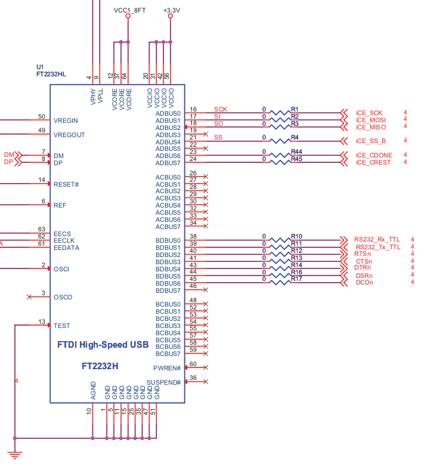
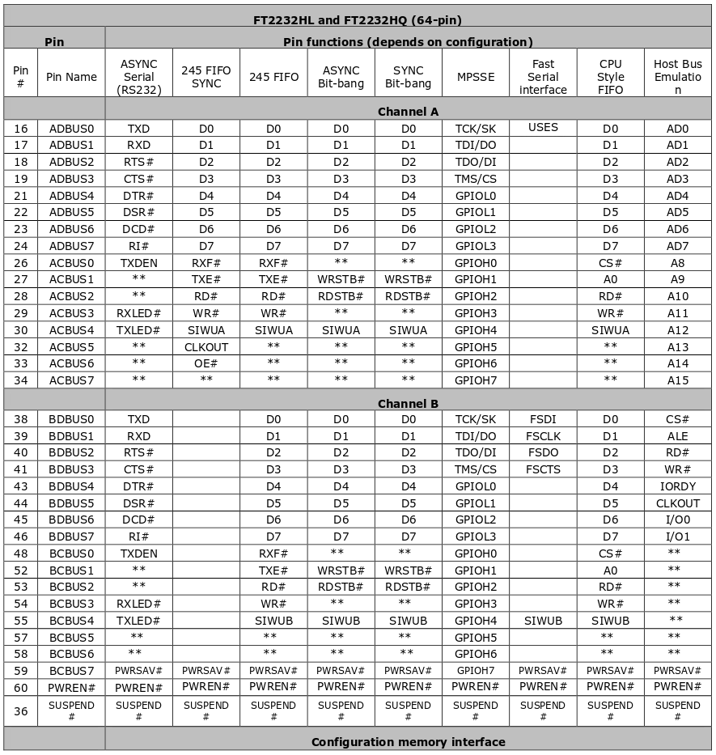

# ICEstick + FTDI FT2232H notes

Changes have been made to the default FT2232H USB bridge configuration so the FPGA and its SPI Flash memory work properly.
___

The FT2232H USB bridge features 2 independent channels with several protocols to use. One on those channels (Channel A) is used to program the onboard SPI Flash memory chip that the FPGA uses to store the synthesized circuit, the other channel, B, is preconfigured as a UART interface.

Because the USB sniffer is using the SPI communication to transmit the USB3300 ULPI data, the default use of the channel B is changed from UART to MPSSE, so we can connect to it properly.

Changes:

* RXd is now TCK/SK (SPI clock). [IO 9]
* TXd is now TDI/DO (SPI MOSI).  [IO 8]
* RTS is now TDO/DI (SPI MISO).  [IO 7]
* CTS is now TMS/CS (SPI SS).    [IO 4]

___

To still can use the UART interface (with external bridge) the pins are now:

* Rx => 61
* Tx => 62